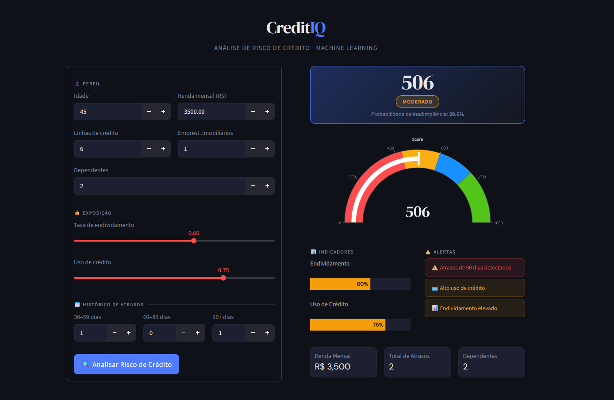

# 💳 CreditIQ — Sistema de Análise de Risco de Crédito


Projeto completo de Machine Learning para previsão de inadimplência, com pipeline end-to-end desde a análise exploratória até o deploy em aplicação interativa.

---

## 📸 Demonstração

<p align="center">
  
</p>

---

## 🚀 Objetivo

Desenvolver um modelo capaz de prever a probabilidade de inadimplência de clientes com base em dados históricos de crédito, auxiliando na tomada de decisão na concessão de crédito.

---

## 📊 Dataset

O projeto utiliza o dataset **"Give Me Some Credit"** (Kaggle), contendo informações financeiras e comportamentais de clientes.

| Variável | Descrição |
|---|---|
| `credit_utilization` | Utilização do limite de crédito disponível (0–1) |
| `late_30_59_days` | Nº de atrasos de 30 a 59 dias nos últimos 2 anos |
| `late_60_89_days` | Nº de atrasos de 60 a 89 dias nos últimos 2 anos |
| `late_90_days` | Nº de atrasos de 90+ dias nos últimos 2 anos |
| `age` | Idade do cliente |
| `monthly_income` | Renda mensal bruta |
| `debt_ratio` | Razão dívida/renda |
| `open_credit_lines` | Nº de linhas de crédito abertas |
| `real_estate_loans` | Nº de empréstimos imobiliários |
| `dependents` | Nº de dependentes |

---

## 🧹 Etapas do Projeto

### 🔍 1. Análise Exploratória (EDA)

- Distribuição da variável target — dataset fortemente desbalanceado
- Visualização de renda e dívida em escala logarítmica por classe
- Análise do comportamento de atrasos por perfil de inadimplência

### ⚙️ 2. Pré-processamento

- Tratamento de valores ausentes com mediana (`monthly_income`, `dependents`)
- Remoção de coluna de índice redundante
- Renomeação padronizada de colunas

### 🔧 3. Feature Engineering (`src/features.py`)

| Feature | Descrição |
|---|---|
| `log_income` | Transformação log da renda para suavizar distribuição assimétrica |
| `log_debt` | Transformação log do debt ratio |
| `zero_income` | Flag binária — renda zero |
| `low_income` | Flag binária — renda abaixo de R$ 2.500 |
| `log_estimated_debt` | Log da dívida absoluta estimada (`debt_ratio × renda`) |
| `income_pressure` | Pressão financeira: `debt_ratio × (1 + late_total)` |
| `has_late_90` | Flag — algum atraso de 90+ dias |
| `severe_late_90` | Flag — 2 ou mais atrasos de 90+ dias |
| `has_late_30` / `has_late_60` | Flags de presença de atrasos menores |
| `extreme_debt` | Flag — debt ratio acima de 0.8 |
| `high_credit_util` | Flag — utilização acima de 0.9 |
| `late_total` | Soma de todos os atrasos |
| `risk_score_simple` | Contagem de fatores de risco ativos |
| `high_risk_low_income` | Interação: atraso grave + renda baixa simultaneamente |

As variáveis de atraso foram limitadas (cap) a 10 ocorrências para reduzir outliers.

### 🤖 4. Modelagem

**Pipeline:**
```
FunctionTransformer(feature_engineering) → RandomForestClassifier
```

O modelo foi treinado com `class_weight={0:1, 1:3}` para compensar o desbalanceamento.

**Tuning com GridSearchCV** (3-fold CV, métrica: `recall`):

| Hiperparâmetro | Valor final |
|---|---|
| `n_estimators` | 100 |
| `max_depth` | 4 |
| `min_samples_split` | 20 |

**Calibração isotônica** — `CalibratedClassifierCV` aplicado sobre o melhor estimador para alinhar probabilidades previstas com taxas reais observadas.

O arquivo `model/model.pkl` contém o **modelo calibrado**, pronto para produção.

---

## 📈 Desempenho do Modelo

O modelo foi otimizado para maximizar o **recall** — em crédito, é preferível investigar um cliente de baixo risco do que deixar passar um inadimplente.

**Classe 1 (inadimplente):**
- Recall: **0.79**
- Precision: **0.19** *(trade-off esperado dado o foco em recall)*

**Avaliações realizadas:** Classification Report · ROC AUC · Matriz de Confusão · Curva ROC · Curva Precision-Recall

**Explicabilidade:** valores SHAP (TreeExplainer) para importância global das features e explicações locais por cliente.

---

## ⚙️ Regras de Negócio (`app/app.py`)

Além do modelo ML, a aplicação aplica um sistema de ajuste de probabilidade baseado em três fatores independentes, cada um com progressão contínua — sem fronteiras duras ou saltos bruscos.

### Sistema de Pisos Independentes

Cada fator gera um índice contínuo [0, 1] e um piso de probabilidade próprio. O maior piso prevalece.

**1. Atrasos — piso máximo: 65%**

Índice ponderado por gravidade: 90d × 3, 60d × 2.5, 30d × 1. Progressão por raiz quadrada.

| Situação | Piso aprox. |
|---|---|
| 1 atraso de 60 dias | 17% |
| 5 atrasos de 60 dias | 27% |
| 10 atrasos de 60 dias | 38% |
| 1 atraso de 90 dias | 46% |
| 5 atrasos de 90 dias | 54% |
| Máximo (10 atrasos 90d) | 65% |

**2. Endividamento — piso máximo: 25%**

Logística suave sobre `debt_ratio + credit_utilization`, centrada em 1.3 (ambos ~0.65).

| Situação | Piso aprox. |
|---|---|
| Ambos em 0.50 | ~3% |
| Ambos em 0.65 | ~12% |
| Ambos em 0.80 | ~21% |
| Ambos em 0.90 | ~24% |

**3. Renda — piso máximo: 55%**

Log-normalizada invertida, logística centrada em 0.4.

| Situação | Piso aprox. |
|---|---|
| Renda R$ 6.000+ | ~1% |
| Renda R$ 3.000 | ~10% |
| Renda R$ 1.500 | ~32% |
| Renda R$ 0 | ~55% |

### Amplificação Adaptativa

O ALPHA que controla o quanto as regras amplificam o modelo é reduzido progressivamente conforme o modelo já está confiante, e limitado a no máximo 1.4× a probabilidade original — evitando amplificação excessiva em casos que o modelo já captou bem.

---

## 💻 Aplicação

O modelo foi integrado em uma aplicação interativa com **Streamlit**, com interface refinada e tema escuro.

A aplicação segue separação de responsabilidades — `app.py` cuida exclusivamente da interface, enquanto a lógica fica em módulos dedicados em `src/`:

| Módulo | Responsabilidade |
|---|---|
| `src/features.py` | Feature engineering para o modelo |
| `src/scoring.py` | Validação de inputs, construção de features, cálculo de score |
| `src/rules.py` | Regras de negócio e ajuste de probabilidade |
| `app/app.py` | Renderização da interface Streamlit |

**Funcionalidades:**
- Formulário de entrada de dados do cliente
- Score de crédito (0–1000) com gauge visual
- Probabilidade de inadimplência
- Classificação de risco com código de cores
- Barras de progresso para endividamento e uso de crédito
- Alertas automáticos baseados em regras de negócio
- Layout responsivo em duas colunas

**Faixas de score:**

| Score | Classificação | Probabilidade aprox. |
|---|---|---|
| 760–1000 | ✅ Excelente | < 18% |
| 600–759 | 🔵 Bom | 18–30% |
| 430–599 | 🟡 Moderado | 30–50% |
| 0–429 | 🔴 Alto Risco | > 50% |

---

## 🗂 Estrutura do Projeto

```
credit-default-project/
│
├── app/
│   ├── app.py           # Interface Streamlit (apenas renderização)
│   └── style.css        # Estilos customizados da interface
│
├── assets/
│   └── app.png          # Screenshot da aplicação
│
├── data/
│   └── raw/
│       ├── cs-training.csv      # Dados de treino
│       ├── cs-test.csv          # Dados de teste
│       └── Data Dictionary.xls  # Dicionário de variáveis
│
├── model/
│   └── model.pkl        # Modelo treinado e calibrado
│
├── notebooks/
│   └── analysis.ipynb   # Análise exploratória e treinamento
│
├── src/
│   ├── __init__.py
│   ├── features.py      # Pipeline de feature engineering
│   ├── scoring.py       # Cálculo de score e validação de inputs
│   └── rules.py         # Regras de negócio e ajuste de probabilidade
│
├── requirements.txt
└── README.md
```

---

## 🚀 Como Executar

```bash
# 1. Clone o repositório
git clone https://github.com/seu-usuario/credit-default-project.git
cd credit-default-project

# 2. Crie e ative um ambiente virtual
python -m venv venv

# Windows
venv\Scripts\activate

# Linux/macOS
source venv/bin/activate

# 3. Instale as dependências
pip install -r requirements.txt

# 4. Rode a aplicação
streamlit run app/app.py
```

A aplicação abrirá automaticamente em `http://localhost:8501`.

---

## 🛠️ Tecnologias

| Pacote | Uso |
|---|---|
| `streamlit` | Interface web interativa |
| `scikit-learn` | Modelo ML, pipeline e calibração |
| `pandas` / `numpy` | Manipulação e transformação de dados |
| `plotly` | Gauge e gráficos interativos |
| `shap` | Explicabilidade do modelo |
| `matplotlib` / `seaborn` | Visualizações na análise exploratória |
| `joblib` | Serialização do modelo |

---

## 🚀 Diferenciais do Projeto

- Pipeline end-to-end de Machine Learning
- Tratamento de dados desbalanceados com pesos de classe
- Feature engineering orientado ao domínio de crédito
- Calibração isotônica de probabilidades
- Explicabilidade com SHAP
- Sistema de regras de negócio com pisos contínuos e sem fronteiras duras
- Interface profissional com tema escuro e design responsivo

---

## 👨‍💻 Autor

Projeto desenvolvido como parte de estudos avançados em Data Science, com foco em aplicações reais de Machine Learning.